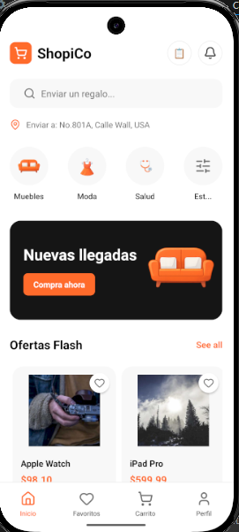
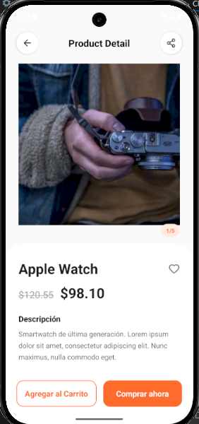
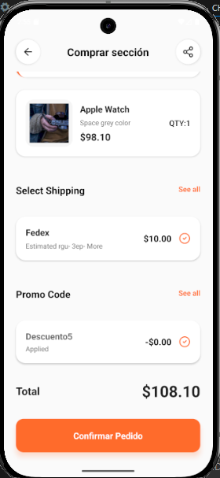
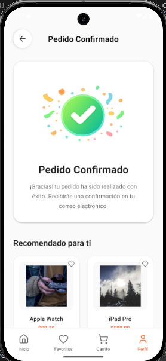
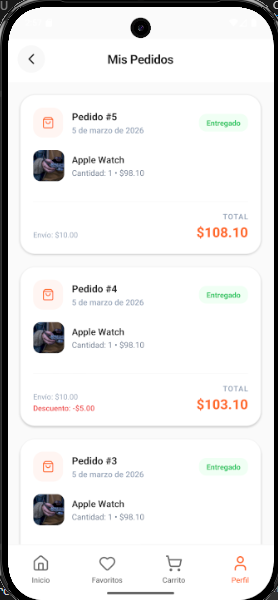
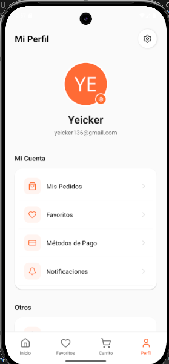
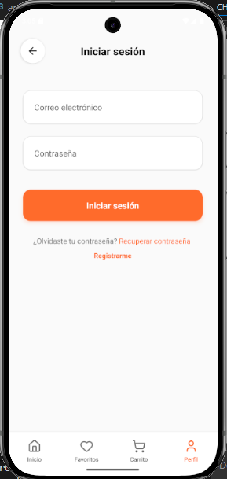
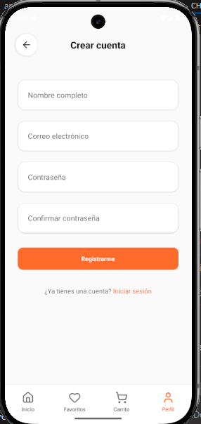

# ShopiCo — Prueba Tecnica de LemonByte.

Aplicación de e-commerce completa construida como parte de la prueba técnica de LEMONBYTE Workshop. Incluye una API RESTful en NestJS (TypeScript) y una app móvil en React Native (TypeScript).

## Arquitectura

- **Backend (API)**: NestJS con TypeORM, MySQL, JWT para autenticación.

- **Frontend (Mobile)**: React Native. 

- **Docker**: Base de datos MySQL alojado en un contenedor.

## Estructura del Proyecto

```
/
├── api/                          # Backend API
│   ├── src/
│   │   ├── auth/                 # Autenticación (JWT, login/register)
│   │   ├── products/             # Productos (CRUD, seed de datos)
│   │   ├── orders/               # Órdenes (crear, listar)
│   │   ├── users/                # Usuarios (entidad base)
│   │   └── main.ts               # Punto de entrada
│   ├── package.json
│   └── README.md
├── mobile/                       # App React Native
│   ├── src/
│   │   ├── components/           # Componentes reutilizables (Button, Alert)
│   │   ├── screens/              # Pantallas (Home, Login, Checkout, etc.)
│   │   ├── navigation/           # Navegación (Stack + Tabs)
│   │   ├── services/             # Servicios API (productos, auth, órdenes)
│   │   ├── context/              # Context de autenticación
│   │   ├── theme/                # Colores y tipografía
│   │   └── types/                # Interfaces TypeScript
│   ├── package.json
│   └── README.md
├── docker-compose.yml            # Base de datos MySQL
└── README.md                     # Este archivo
```

## Configuración y Ejecución

### Prerrequisitos
- Node.js ≥ 18
- npm o yarn
- Docker (para MySQL)
- React Native CLI
- Android Studio o Xcode configurado

### 1. Clonar y Instalar Dependencias

```bash
# Instalar dependencias de API
cd api
npm install

# Instalar dependencias de Mobile
cd ../mobile
npm install

# Solo iOS: Instalar pods
cd ios && pod install && cd ..
```

### 2. Configurar Base de Datos

```bash
# Levantar MySQL con Docker
cd api
docker-compose up -d
```

### 3. Migraciones y Seed

En este proyecto, TypeORM está configurado con `synchronize: true`, lo que significa que las migraciones se ejecutan automáticamente al iniciar la aplicación (crea/actualiza el esquema de la base de datos).

El seed de productos se ejecuta automáticamente al iniciar la API (método `onApplicationBootstrap` en `ProductsService`).

No se requieren comandos manuales para migraciones o seed.

Este proceso se hizo solamente para cumplir con la prueba técnica.

### 4. Ejecutar API (Backend)

```bash
cd api
npm run start:dev
```


### 4. Ejecutar App Móvil


#### Ejecutar
```bash
cd mobile

# Android
> npx react-native run-android
> npm run android (Alternativa viable)

# iOS
> npx react-native run-ios
> npm run ios

# Verificacion de tipados
npm run type-check
```

## ENVIROMENTS

### API

```bash
> api/.env
DB_HOST=localhost
DB_PORT=3306
DB_USER=root
DB_PASS=passwordtest
DB_NAME=db_lemonbyte
JWT_SECRET=JWT_LEMONPRUEBA_TECNICA

> mobile/.env
API_URL=http://10.0.2.2:3000 # Esta URL funciona para Android Studio.
# API_URL=http://192.168.1.X:3000  # Para dispositivo físico o simulador iOS (reemplaza X con tu IP local)
# Consola de Comandos -> ipconfig -> IPV4 de la maquina.

# Se recomienda por motivos de seguridad modificar la información, ya que las mostradas a continuación son para pruebas de desarrollo.
```

## Datos de Prueba

### Productos Ingresados sugeridos por datos adicionales.txt.
- Apple Watch: $98.10
- iPad Pro: $599.99
- Hoodie Blanca: $35.00
- Zapatillas Deportivas: $79.99

### Cupón

- Código: **DESCUENTO5** → Descuento de $5.00

<div align="center">
<h3 align="center">Pantallas del Proyecto</h3>
  <table>
    <tr>
      <td align="center"><b>Inicio</b><br></td>
      <td align="center"><b>Detalles</b><br></td>
      <td align="center"><b>Pedido</b><br></td>
    </tr>
    <tr>
      <td align="center"><b>Confirmado</b><br></td>
      <td align="center"><b>Mis Pedidos (Adicional)</b><br></td>
      <td align="center"><b>Perfil (Adicional)</b><br></td>
    </tr>
    <tr>
          <td align="center"><b>Iniciar Sesion</b><br></td>
      <td align="center"><b>Registro</b><br></td>
    </tr>
  </table>
</div>